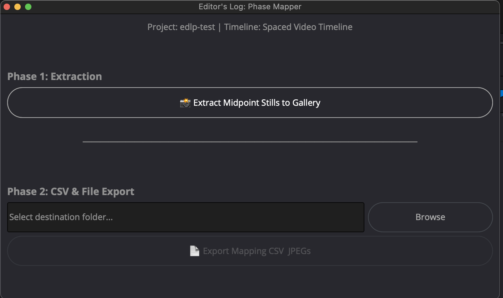

# 🎬 EditorsLogger

**EditorsLogger** is an automated logging tool that helps editors create clear, comprehensive logs for each scene and take — making it easier to track footage and speed up the editing process.

Built for **solo editors, assistant editors, film students, documentary editors, and post-production teams** who want to replace manual logging with a faster, cleaner workflow.

---

## 📌 Overview

When starting a new project, remembering what’s in each take of every scene can be difficult.  
Manually writing logs is time-consuming and often breaks creative focus.

EditorsLogger automates the logging process so editors can focus on watching footage, writing notes, and making better editorial decisions.

---

## ✨ Features

- Scene-by-scene and take-by-take logging
- Automatic still extraction from timeline clips
- Clean **PDF log export**
- Editor-agnostic output (usable with any NLE)
- Designed to fit naturally into existing post-production workflows

---

## 🧠 How It Works

EditorsLogger uses a **2-step approach**:

1. A **DaVinci Resolve script**:
   - Extracts still images from each clip on the timeline
   - Generates a corresponding `.csv` file


2. EditorsLogger:
   - Reads the `.csv`
   - Binds stills to each take (called an *entry*)
   - Allows editors to review and annotate before export
! [EditorsLogger UI](assets/sc2.png)
! [EditorsLogger UI](assets/sc3.png)

---

## 🛠 Workflow

1. Run the script inside **DaVinci Resolve**
   - Select a location to save stills and the `.csv` file
2. Drag and drop the folder containing the stills into **EditorsLogger**
3. Review takes and write notes inside the app
4. Export a **PDF log**

---

## 📦 Requirements

- **DaVinci Resolve Studio**  
  *(Free version is not supported)*
- **macOS**  
  *(Windows currently untested)*
- **Python 3.10**
- Python dependencies:
  - `PySide6 >= 6.5.0`
  - `reportlab >= 4.0.0`

---

## ⚙️ Installation

Clone the repository:

```bash
git clone https://github.com/Dkhanh0412/EditorsLogger.git
````

Install required dependencies:

```bash
pip install -r requirements.txt
```

---

## ▶️ Running EditorsLogger

You can launch EditorsLogger in one of the following ways:

* Run the Python script directly:

  ```bash
  python main.py
  ```
* Launch the included **macOS `.app` executable**

---

## 🖼 Screenshots

Screenshots of the user interface are included in the repository to showcase the workflow and layout.

---

## ⚠️ Limitations & Notes

* Works only with **DaVinci Resolve Studio**
* **macOS only** (Windows support planned)
* Experimental / early-stage project
* Tested only on the author’s own projects

---

## 🛣 Roadmap

Planned features and improvements:

* Windows support

---

## 🎓 What I Learned Building This

Building EditorsLogger helped me translate real post-production problems into practical workflow solutions.

As an editor, I learned how much time is lost to manual logging and how small automations can improve speed, clarity, and creative focus. Most importantly, it reinforced the importance of designing tools from an **editor’s perspective**, so they enhance existing pipelines rather than disrupt them.

---

## 🤝 Contributing

This is a personal project, but **issues are welcome**.
Bug reports, feature suggestions, and feedback are appreciated.

---

## 📄 License

This project is licensed under the **MIT License**.
